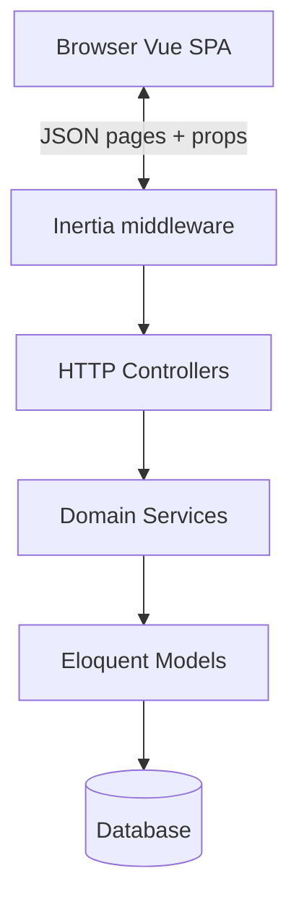

# Architecture

## Tech stack

| Layer | Technology | Version / notes |
|-------|------------|-----------------|
| Runtime | PHP | ^8.3 |
| Framework | Laravel | ^13.8 |
| SPA bridge | Inertia.js (Laravel + Vue) | ^3.x |
| Frontend | Vue 3 | ^3.5 |
| Build | Vite | ^8 |
| CSS | Tailwind CSS | ^4 |
| UI components | Nuxt UI | ^4.9 |
| Client routing names | Ziggy | ^2.6 |
| Charts | ApexCharts | vue3-apexcharts |
| Authorization | spatie/laravel-permission | ^8 |
| PDF | barryvdh/laravel-dompdf | Invoice print/download |
| Excel | maatwebsite/excel | Import/export |
| Media | spatie/laravel-medialibrary | Product images |
| Backup | spatie/laravel-backup | Data tools |
| DB (local) | SQLite | `database/database.sqlite` |
| DB (prod) | MySQL 8 | See [DEPLOYMENT.md](./DEPLOYMENT.md) |
| Tests | PHPUnit | ^12 |

> **Note:** Root `README.md` may still mention Livewire/Mary UI from an earlier stack. The live app uses **Inertia + Vue + Nuxt UI** (`resources/js/inertia.js`).

## High-level diagram



## Multi-tenancy & branch scoping

| Concept | Implementation |
|---------|----------------|
| **Tenant** | `users.tenant_id`, `Tenant` model, global `TenantScope` on catalog models |
| **Branch context** | `BranchContext` service; topbar selector posts to `branch-context.update` |
| **Settings** | `SettingsManager` — tenant-wide or branch override |
| **Platform mode** | Super admin operates outside tenant; `TenantContext::isPlatformMode()` |

Key files:

- `app/Services/Tenancy/TenantContext.php`
- `app/Services/Branch/BranchContext.php`
- `app/Services/Settings/SettingsManager.php`
- `app/Models/Scopes/TenantScope.php` (if present)

## Backend layers

```
app/
├── Http/Controllers/       Thin controllers → Inertia responses
├── Http/Requests/          Validation for complex forms
├── Http/Middleware/        Locale, Inertia share, onboarding, shop tenant
├── Models/                 Eloquent entities
├── Services/               Business logic (preferred home for rules)
└── Support/                Helpers: Money, TenantMoney, InvoiceDesign, Navigation
```

**Convention:** Controllers load/filter data and call services. Services own transactions, stock, payments, numbering.

## Frontend layers

```
resources/js/
├── inertia.js              App bootstrap (Vue + Nuxt UI + Ziggy)
├── layouts/
│   ├── AppLayout.vue       ERP shell (sidebar / tablet mode)
│   ├── GuestLayout.vue     Login
│   └── ShopLayout.vue      Public catalog
├── pages/{Module}/Index.vue   One primary page per module
├── components/             Reusable UI (DataTable, FormModal, …)
└── composables/            Shared logic (useTrans, useFormDraft, …)
```

## Shared Inertia props

`HandleInertiaRequests` shares on every authenticated page:

| Prop | Purpose |
|------|---------|
| `auth.user` | id, tenant_id, permissions, roles |
| `locale` | current, dir, available |
| `layout.mode` | `regular` or `tablet` |
| `translations` | Full active locale PHP lang files |
| `nav` | Filtered sidebar items |
| `branding` | Logo, colors, company name |
| `branchContext` | Current branch, allowed branches |
| `notifications` | Bell unread count + recent items |
| `notificationPrefs` | e.g. sound enabled |
| `money` | `currency`, `exchangeRate` (tenant setting) |
| `flash.toast` | Server toast messages |

## Security

- Session-based authentication (`AuthController`)
- Permission middleware on route groups (`permission:…`)
- `SecurityHeaders` middleware (CSP)
- Branch/tenant isolation enforced in services and global scopes
- Public shop: no auth; tenant resolved by slug; 404 when disabled (admins can preview when logged in)

## Invoice & money

- **Exchange rate:** `App\Support\TenantMoney::exchangeRate()` reads Settings → Currency
- **Invoice PDF:** `InvoiceDocumentController` + design from `config/invoice.php` (`classic`, `minimal`, `compact`)
- **Formatting:** `App\Support\Money` for display

## Public shop

- Routes: `/shop/{tenant:slug}`, `/shop/{tenant:slug}/products/{id}`
- Middleware: `ResolveShopTenant` — resolves tenant, checks `shop.enabled` setting
- Admin config: `/settings/shop` (`ShopSettingsController`)

## Testing

- `php artisan test` — PHPUnit feature tests per domain
- Pattern: seed roles/modules, create tenant+branch+user, assert HTTP/Inertia

See [frontend.md](./frontend.md) and [modules-reference.md](./modules-reference.md) for detail.
