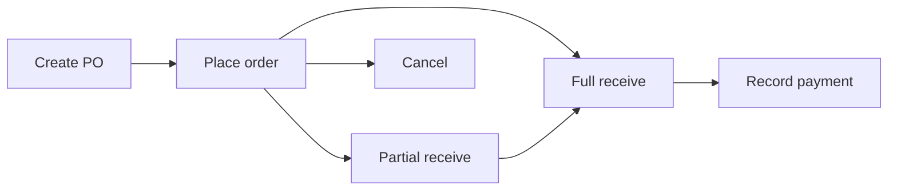

# User Flows

Step-by-step business processes. For screen-level instructions see [user-guide.md](./user-guide.md).

---

## 1. Login & first visit

```mermaid
flowchart TD
    A[Visit /login] --> B{Valid credentials?}
    B -->|No| A
    B -->|Yes| C{Super admin?}
    C -->|Yes| D[Platform dashboard]
    C -->|No| E{Onboarding complete?}
    E -->|No| F[Onboarding wizard]
    E -->|Yes| G{Tablet mode?}
    G -->|Yes| H[/links launcher]
    G -->|No| I[Dashboard]
```

---

## 2. Sales — cash invoice

1. Select **branch** in topbar (if multiple).
2. Open **Sales** → **New sale**.
3. Add line items (product, qty, price).
4. Set sale type **Cash**, payment method, paid amount.
5. Exchange rate prefilled from Settings → Currency.
6. Submit → stock deducted, invoice posted.
7. Optional: **Print** or **PDF** from invoice actions.

**Hold draft (server):** Save as draft → resume later → **Post** or **Discard**.

**Form draft (browser):** Leave mid-form → yellow draft badge → **Continue** restores via `?draft=sales.create`.

---

## 3. Sales — credit invoice

1. Same as cash, but sale type **Credit**.
2. **Customer required.**
3. Due date optional.
4. Balance appears in **Debts → Receivables**.

---

## 4. Collect customer debt

1. **Debts** → Receivables tab.
2. Find customer → **Collect**.
3. Enter amount, method, date.
4. System applies to oldest invoices first.

---

## 5. Purchase order lifecycle



---

## 6. Inventory receive

1. **Inventory** → **Receive stock**.
2. Select product, variant (if any), quantity, unit cost.
3. Submit → batch created, on-hand increased.

---

## 7. Stock transfer between branches

1. **Stock transfers** → **New transfer**.
2. From branch, to branch, line items.
3. Workflow: Requested → Approved → Dispatched → Received (or Cancelled).

---

## 8. Shipment workflow

1. **Shipping** → **New shipment** (link to sales invoice optional).
2. Advance status through processing → in transit → delivered.
3. **Deliver** may require proof-of-delivery upload.
4. **Return** registers product return from shipment.

---

## 9. Settings — currency & exchange rate

1. **Settings** → **Currency** tab.
2. Set default currency (SDG/USD) and exchange rate (e.g. 4900).
3. Save → rate flows to Dashboard, Sales, Reports via `TenantMoney`.

---

## 10. Settings — invoice design

1. **Settings** → **Invoice** tab.
2. Pick design card (Classic / Minimal / Compact).
3. **Preview example** for full mock invoice.
4. Set prefix and footer → Save.
5. All new print/PDF uses selected template.

---

## 11. Public shop setup

1. **Settings** → link to **Shop settings** (`/settings/shop`).
2. Enable **Public shop**.
3. Set **Hero title** (required when enabled).
4. Configure contact info, banners, share message.
5. **Save** → link `/shop/{slug}` live for visitors.
6. On **Products**, toggle **Show on shop** / **Featured**.

**Preview while disabled:** Admins logged in can open shop URL before publishing.

---

## 12. Tablet mode

1. Profile menu → toggle **Tablet mode**.
2. Sidebar hidden; home becomes **Links** (app icons).
3. FAB opens full navigation launcher.
4. Draft reminder appears in topbar instead of floating.

---

## 13. Data import / backup

1. **Data tools** → Import tab: choose dataset, upload Excel.
2. Export tab: download CSV/Excel by type.
3. Backups tab: create/download/delete backup archives.

---

## 14. Platform admin — enter tenant

1. Super admin → **Platform** → Tenants.
2. **Enter** tenant → operate as that tenant's context.
3. **Exit** returns to platform scope.
